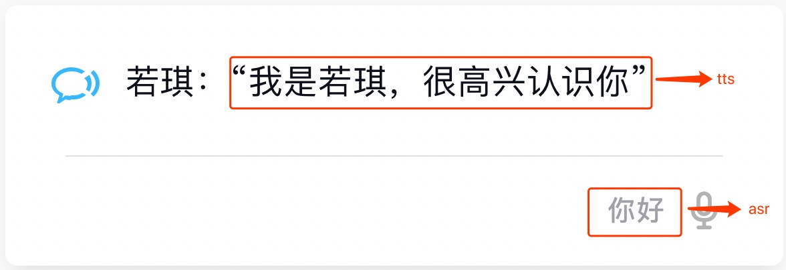

# Vui 模块

## Card 样式说明 

### chat样式
 
**消息格式**：

 ```json
{
    "type": "Chat",
    "template": "xxx",
    //asr内容（你对若琪说的话）
    "feedback": {
        "voiceUrl": null,
        "voice": "你好"
    },
    //来自于应用的 appid
    "appid": "E33FCE60E7294A61B84C43C1A171DFD8"
}

 ```
 
 **template** ：

 ```json
{"tts":"我是若琪，很高兴认识你"}
 ```
 
 
 **图示**：
 

---
  
### Brief summary样式  

**消息格式** ：

 ```json
{
    "appid": "com.rokid.alarm1",
    "feedback": {
        "voice": "帮我设置一个明天早上十点的闹钟"
    },
    "id": "475b8d28-6a06-4453-993f-84c724876794",
    "template": "xxxx",
    "type": "Summary"
}
 ```
**template** ： 

 ```json
{
    "buttons": [
        {
            "title": "查看已设置的闹钟",
            //点击跳转的url
            "url": "rokid://app/alarm?deviceId\u003d02010217020001ED"
        }
    ],
    "icon": "https://s.rokidcdn.com/mobile-app/icon/card/alarm.png",
    "items": [
        {
            //点击跳转的url
            "linkUrl": "rokid://app/alarm?deviceId\u003d02010217020001ED",
            "subtitle": "2017年12月15日",
            "title": "10:00"
        }
    ],
    "title": "闹钟",
    "type": "Brief"
}
 ```
 
 
 **图示**：
 

---

### simple summary样式  

**消息格式** ：

 ```json
{
    "appid": "com.rokid.xxxx",
    "feedback": {
        "voice": "xxxx"
    },
    "id": "475b8d28-6a06-4453-993f-84c724876722",
    "template": "xxxx",
    "type": "Summary"
}
 ```
**template** ： 

 ```json
{
    "icon": "https://s.rokidcdn.com/mobile-app/icon/card/tips.png",
    "title": "若琪",
    "type": "simple",
    "items": [
        {
            "title": "你好，主人！",
            "contents": [
                "我已经准备好与你进行第一次对话，试试对我说：“若琪，介绍一下你自己”\n想了解我的更多技能吗？"
            ]
        }
    ],
    "buttons": [
        {
            "title": "查看「若琪技能」",
            "url": "https://skill.rokid.com/store"
        }
    ]
}
 ```
 **图示**：
 
 

 
---

### image summary样式  

**消息格式** ：

 ```json
{
    "dbId": 0,
    "from": "02010217020001ED",
    "msgStamp": "Dec 14, 2017 6:22:02 PM",
    "msgTxt": "xxx",
    "topic": "card"
}
 ```
**template** ： 

 ```json
{
    "type": "Image",
    "title": "故事",
    "subtitle": "",
    "icon": "https://s.rokidcdn.com/mobile-app/icon/card/music.png",
    "items": [
        {
            "title": "白雪公主下",
            "subtitle": "白雪公主",
            "imageUrl": "https://rokidstorycdn.rokid.com/story/album/4663853/wKgJKld7ZleCvqS6AAK2YslhXsw742_mobile_large.jpg",
            "imageType": "Circle",
            "linkUrl": "rokid://media/v3/detail?id\u003dea7c48fea1654376acbc6d837c6b8d22\u0026appId\u003dR7C638312DA94C54BFE5B3BE2FE33E44"
        }
    ],
    "buttons": [
        {
            "title": "查看专辑详情",
            "url": "rokid://media/v3/detail?id\u003dea7c48fea1654376acbc6d837c6b8d22\u0026appId\u003dR7C638312DA94C54BFE5B3BE2FE33E44"
        }
    ]
}
 ```
 **图示**：


---

