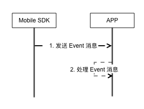

# 消息 Event

## 简介

Mobile SDK 发送的一些 Event 消息，根据业务需求 接收 并实现具体功能。

## 流程



## 支持库

<font color=red size=3>**目前Event 使用 EventBus 进行封装，请引入EventBus 库**</font>

```
compile 'org.greenrobot:eventbus:3.0.0'
```


