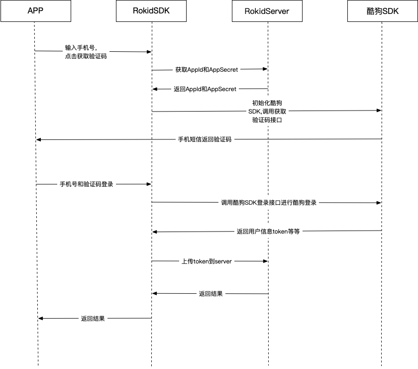

## 酷狗音乐授权H5接入

### 概述

本文档适用于第三方厂商使用酷狗音乐技能。用户通过手机号和短信验证码登录获取token，RokidSDK对设备进行授权，授权成功的设备才可以使用酷狗音乐skill。

### 酷狗音乐授权流程

* 时序图

### 接入步骤

1. 集成RokidSDK

  首先需要在项目中集成RokidSDK，集成文档：<https://rokid.github.io/mobile-sdk-android-docs/res/10_use_sdk.html>

2. 集成酷狗音乐SDK

  酷狗音乐SDK和文档地址：请联系商务获取

3. WebBridge接入

  RKWebBridge：<https://rokid.github.io/mobile-sdk-android-docs/res/71_use_bridge.html>

4. 酷狗音乐授权H5页面接入

  酷狗音乐授权H5页面：<https://s.rokidcdn.com/mobile-app/h5/media/index.html#/kugou/userInfo>
