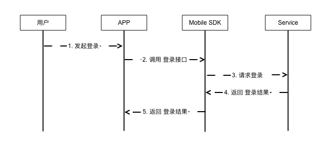

# 若琪账号体系

## 登录流程

1、流程



2、接口

参数说明

| 字段    | 类型   | 必须？| 说明 |
| ------ | ----- | ----- | ----- |
| phoneNum  | String | 是 | 手机号 |
| passwd   | String | 否 | 密码 |

**举个大栗子：**

Java:

```java
RokidMobileSDK.account.login(phoneNum, passwd, new ILoginResultCallback() {
    @Override
    public void onLoginSucceed() {
        Logger.d("onLoginSuccess is called.");
        ... // do something
    }

    @Override
    public void onLoginFailed(String errorCode, String errorMsg) {
        Logger.e("onLoginFailed errorCode=" + errorCode + " errorMsg=" + errorMsg);
        ... // do something
    }
});
```


